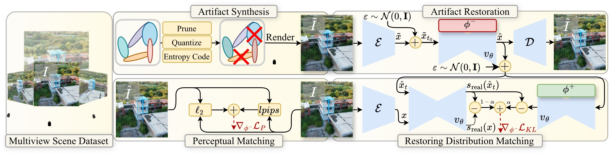
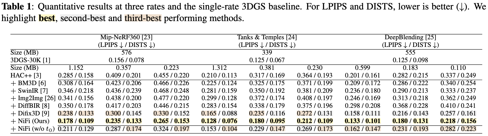

## Nix and Fix: Targeting 1000× Compression of 3D Gaussian Splatting with Diffusion Models
[](https://arxiv.org/abs/2602.04549)

Cem Eteke, Enzo Tartaglione

Accepted at 2026 IEEE International Conference on Image Processing (ICIP)

### Overview


### Abstract

<details close>
<summary><strong>Show abstract</strong></summary>

<br>

3D Gaussian Splatting (3DGS) revolutionized novel view rendering. Instead of inferring from dense spatial points, as implicit representations do, 3DGS uses sparse Gaussians. This enables real-time performance but increases space requirements, hindering applications such as immersive communication. 3DGS compression emerged as a field aimed at alleviating this issue. While impressive progress has been made, at low rates, compression introduces artifacts that degrade visual quality significantly. We introduce NiFi, a method for extreme 3DGS compression through restoration via artifact-aware, diffusion-based one-step distillation. We show that our method achieves state-of-the-art perceptual quality at extremely low rates, down to 0.1 MB, and towards 1000x rate improvement over 3DGS at comparable perceptual performance.

</details>

### Inference

You can simply run `inference.py` on a given image path by using the `inference.py` script.

```
python inference.py --help
usage: inference.py [-h] [--base_model BASE_MODEL] [--ckpt CKPT] --lq LQ --out OUT [--device DEVICE] [--embeddings EMBEDDINGS] [--dtype {bf16,f16,f32}]

options:
  -h, --help            show this help message and exit
  --base_model BASE_MODEL
                        Path to Stable Diffusion 3
  --ckpt CKPT           Path to restoration adapter weights.
  --lq LQ               Low-quality image path
  --out OUT             Output
  --device DEVICE       Device
  --embeddings EMBEDDINGS
                        Default text embeddings. See embeddings.py for details.
  --dtype {bf16,f16,f32}
                        Model dtype.
```

This script requires the base `stable-diffusion-3-medium` model path (default `checkpoints/stable-diffusion-3`) and our method's weights (default `3dgs-compression-restore.ckpt`). The model weights will be available soon. Furthermore, we provide default text embeddings under `example/default_embeddings.npz`. Please refer to `embedding.py` for further details.  

After placing the Stable Diffusion 3 folder and the model checkpoint please run

```
python inference.py --lq example/lq.png --out example/hq.png
```

to perform inference.  

In our work we performed this restoration on renderings of HAC++. The example in `example/lq.png` is such a rendering from HAC++ with `lambda=1.0`. We linked the codebase of HAC++ below.

### Training

We used extended the codebase of RAVE to extremely prune 3DGS models trained on DL3DV dataset to create the extreme-low-rate 3DGS artifact restoration dataset. RAVE and DL3DV are linked below. We will share the artifact simulation and training code soon.

### Results



### References

Our implementation heavily relies on

- TSD-SR: https://github.com/Microtreei/TSD-SR
- Stable Diffusion: https://huggingface.co/stabilityai/stable-diffusion-3-medium 
- RAVE: https://github.com/inspiros/RAVE 
- DL3DV-10K: https://github.com/DL3DV-10K/Dataset 

We thank them for the amazing work!

The 3DGS extensions are under Gaussian-Splatting License, while the shared pretrained weights are under Stable Diffusion license.

### Cite

If you use our work please cite:

```
@article{eteke2026nix,
  title={Nix and Fix: Targeting 1000x Compression of 3D Gaussian Splatting with Diffusion Models},
  author={Eteke, Cem and Tartaglione, Enzo},
  journal={arXiv preprint arXiv:2602.04549},
  year={2026}
}
```
